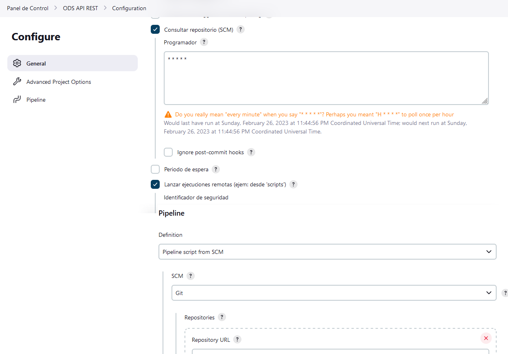
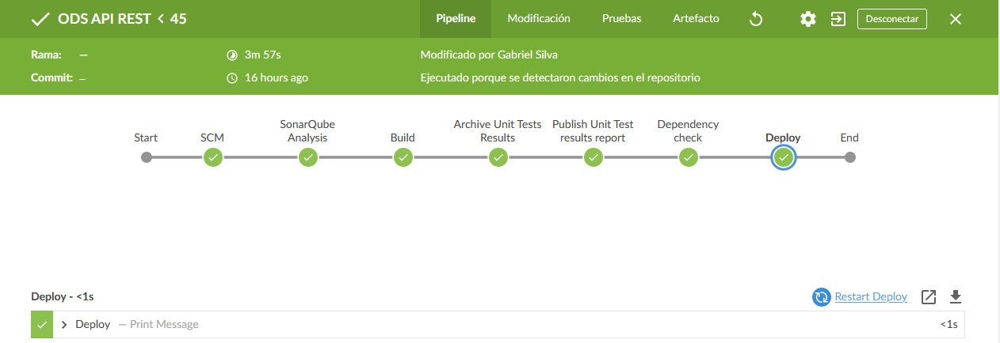
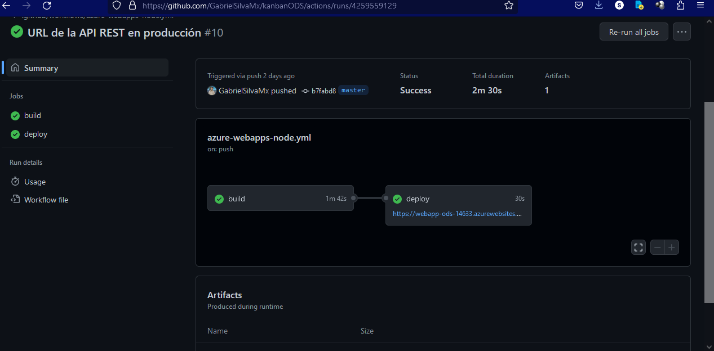

# Terraform e Implementación en Azure


## Spring Boot

Para el despliegue de la API REST  con Spring Boot se creó una pipeline con Jenkins.

En este pipeline se configuró para que el Trigger se dispare de manera automática cada vez que haya un cambio en la rama Master del repositorio de https://github.com/GabrielSilvaMx/ODS.



En la configuración del archivo POM se definieron las etapas (stage) para que se ejecuten en Jenkins.




## Terraform

Una vez que el pipeline haya terminado con éxito se procede a ejecutar terraform para crear los servicios en Azure para la base de datos de MySQL y dos servicios Azure App para crear y hospedar la aplicación web de Angular y el back-end de la API RESTful.

---
**Inicialización de los servicios con Terraform**

Para inicializar la implementación de Terraform, ejecutar:
```
terraform init
```
 Este comando descarga los módulos de Azure necesarios para administrar los recursos de Azure.

Ejecutar terraform plan para crear un plan de ejecución.
```
terraform plan -out main.tfplan
```

Ejecutar terraform apply para aplicar el plan de ejecución en Azure.
```
terraform apply main.tfplan
```


## Angular

Para el despliegue de la aplicación con Angular se utilizó Github Actions.

Se generó un pipeline que permita desplegar la aplicación en el servidor de Azure. En el archivo de configuración se definieron los entornos tanto de **desarrollo** como de **producción**.

*angular.json*
```
...
"production": {
              "fileReplacements": [
                {
                  "replace": "src/environments/environment.ts",
                  "with": "src/environments/environment.prod.ts"
                }
              ],
...
```


*.github/workflows/azure-webapps-node.yml*
```
...
- name: npm install, build, and test
      run: |
        npm install
        npm run build --production
...
```


