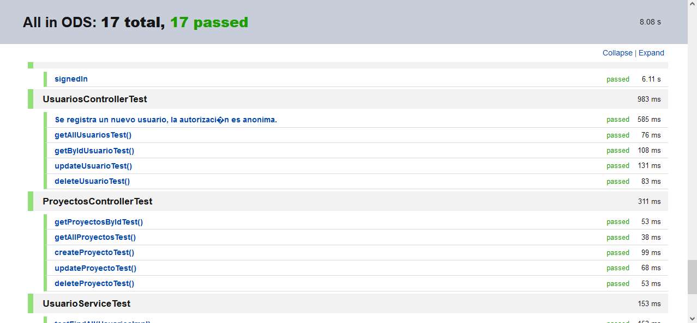
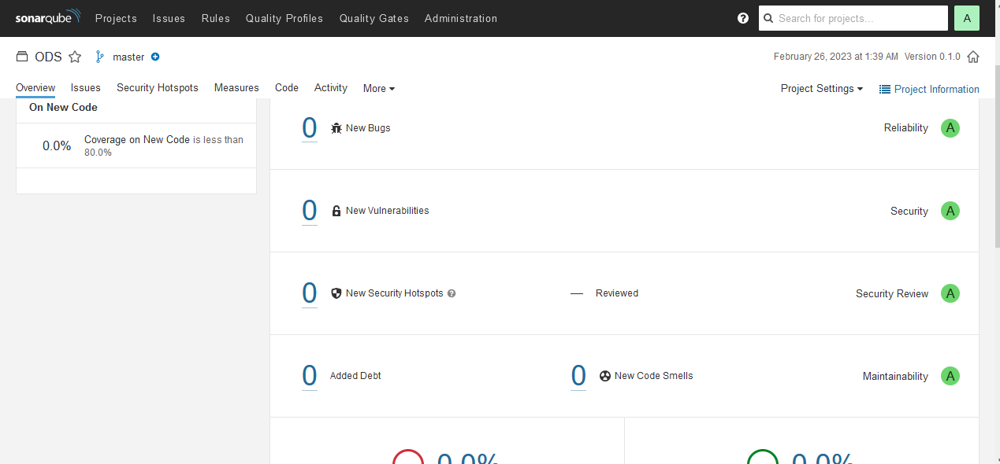
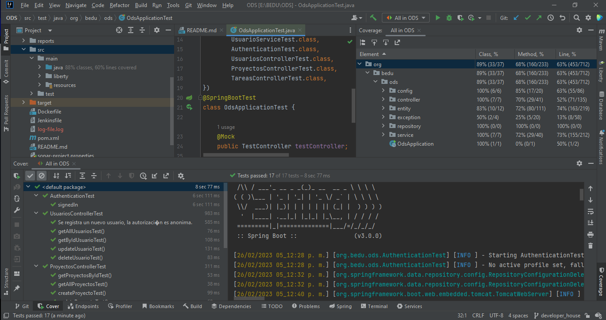
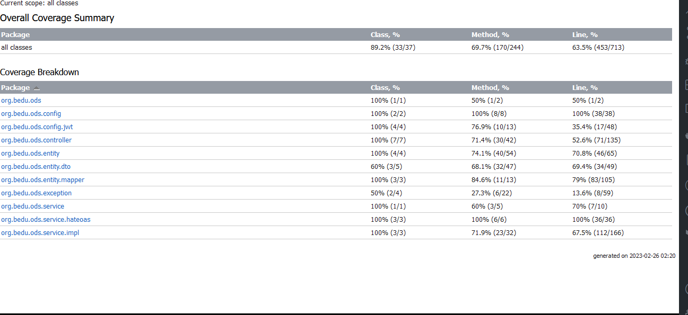

# Pruebas unitarias y Coverage

Las pruebas unitarias se realizaron con JUnit para las clases del controlador y de las clases de entity.

Las pruebas se ejecutan en el test principal de la aplicación:

*OdsApplicationTest.java*
```
@RunWith(Suite.class)
@Suite.SuiteClasses({
        UsuarioServiceTest.class,
        AuthenticationTest.class,
        UsuariosControllerTest.class,
        ProyectosControllerTest.class,
        TareasControllerTest.class,
})
```
[Resultados Pruebas Unitarias](https://github.com/GabrielSilvaMx/ODS/blob/developer_house/reports/Test%20Results%20-%20All_in_ODS.html)





Para las pruebas anteriores se utilizó una base de datos de prueba para no tocar la base de datos de producción:

*test/db-test.properties*
```
spring.datasource.url=jdbc:mysql://${LOCAL_DATABASE_NAME}:3306/db_ods_test?serverTimezone=UTC
spring.datasource.username=${LOCAL_MYSQL_NON_ADMIN_USERNAME}
spring.datasource.password=${LOCAL_MYSQL_NON_ADMIN_PASSWORD}
```

## Inspección continua

Para la ejecución del análisis e inspección continua utilizamos SonarQube. Después de refactorizar y eliminar *code smell* la herramienta nos arroja que no se encontró ningún problema por lo que se consigue que el código sea seguro y de calidad.



## Coverage

Con IntelliJ IDEA para la cobertura de código nos muestra un 63% de líneas cubiertas:



Los resultados se pueden consultar en el repositorio principal:

 [Reporte Coverage](https://github.com/GabrielSilvaMx/ODS/tree/developer_house/reports)




